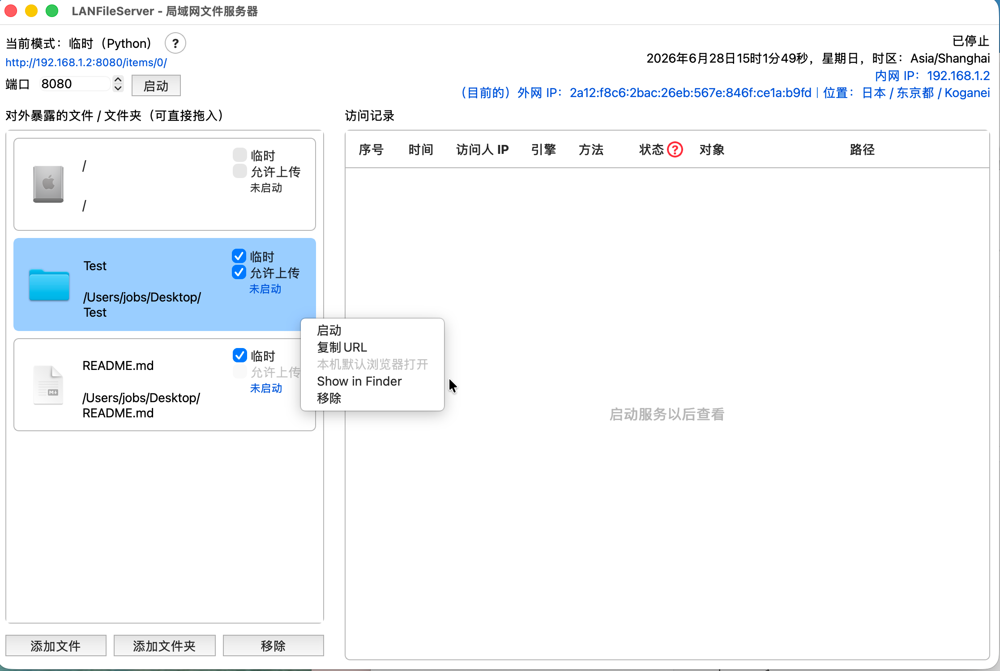
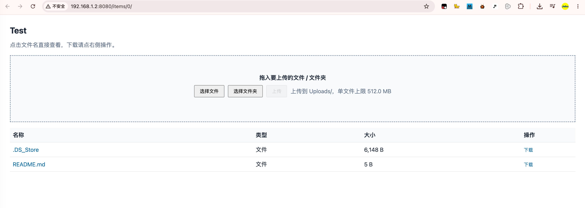

# `LANFileServer`


[toc]

---

## 🔥 <font id=前言>前言</font>






## 一、目录结构 <a href="#前言" style="font-size:17px; color:green;"><b>🔼</b></a> <a href="#🔚" style="font-size:17px; color:green;"><b>🔽</b></a>

```text
.
├── README.md
├── 【MacOS】📦生成dmg.command
├── 【Windows】📦生成exe.bat
├── LANFileServer-macOS-universal2.dmg
└── LANFileServer/
    ├── LANFileServer.py
    ├── README.md
    ├── requirements.txt
    ├── requirements-build.txt
    ├── 启动LANFileServer.command
    └── 启动LANFileServer.bat
```

- `./README.md`：当前外层目录说明。
- `./【MacOS】📦生成dmg.command`：macOS 外层入口，双击后转交给 `./LANFileServer/启动LANFileServer.command`，并生成 `./LANFileServer-macOS-universal2.dmg`。
- `./【Windows】📦生成exe.bat`：Windows 外层入口，双击后转交给 `./LANFileServer/启动LANFileServer.bat`。
- `./LANFileServer-macOS-universal2.dmg`：macOS 可分发安装包，兼容 Intel 和 Apple Silicon。
- `./LANFileServer/`：内部项目目录，保存源码、依赖、构建脚本、`.app` 产物和项目级 README。

## 二、运行方式 <a href="#前言" style="font-size:17px; color:green;"><b>🔼</b></a> <a href="#🔚" style="font-size:17px; color:green;"><b>🔽</b></a>

### 2.1、macOS

- 双击外层脚本：

  ```text
  ./【MacOS】📦生成dmg.command
  ```

- 外层脚本会自动寻找内部项目启动器：

  ```text
  ./LANFileServer/启动LANFileServer.command
  ```

- 内部启动器会准备双架构构建环境、安装或复用依赖、打包 `.app`，最后在外层目录生成：

  ```text
  ./LANFileServer-macOS-universal2.dmg
  ```

- 黑色终端窗口是打包窗口。看到 `DMG 已生成` 后，可以关闭这个窗口。
- `.dmg` 可以直接打开运行里面的 App，也可以把 App 拖入系统 `Applications` 文件夹。

### 2.2、Windows

- 双击外层脚本：

  ```text
  ./【Windows】📦生成exe.bat
  ```

- 外层脚本会转交给内部项目启动器：

  ```text
  ./LANFileServer/启动LANFileServer.bat
  ```

- 内部启动器会创建或复用 `.venv`、安装缺失依赖，然后启动图形界面。

## 三、使用说明 <a href="#前言" style="font-size:17px; color:green;"><b>🔼</b></a> <a href="#🔚" style="font-size:17px; color:green;"><b>🔽</b></a>

1. 打开 `LANFileServer`。
2. 把要暴露给局域网其它设备访问的文件或文件夹拖入左侧列表。
3. 每个项目都可以单独选择“临时（Python）”或“非临时（Nginx）”。
4. 文件夹项目可以按需勾选“允许上传”；对方浏览器上传的文件只会写入该共享文件夹下的 `Uploads/` 子目录。
5. 选中左侧项目，点击顶部启动按钮。
6. 把顶部蓝色访问地址发送给同一局域网内的其它电脑或手机。
7. 右侧访问记录会显示访问时间、访问人 IP、服务引擎、状态码、对象和路径。

- 浏览器目录页里点击文件名或文件夹名默认查看；需要下载时点击右侧“下载”。
- 下载统一返回 `主体名.zip` 压缩包；文件解压后得到原文件，文件夹解压后得到同名文件夹。
- 允许上传的目录页会显示上传区，支持拖入文件 / 文件夹，也支持点“选择文件”“选择文件夹”后再点“上传”。
- 拖入文件 / 文件夹后会先进入待上传队列，页面会弹窗询问是否现在上传；取消后不会立刻写入本机，仍可稍后手动点“上传”。
- 单文件上限 `512 MB`，文件夹上传会保留相对目录结构，同名文件会自动改名，不会覆盖已有文件。
- 左侧项目支持右键菜单，可以执行启动 / 停止、复制 URL、本机默认浏览器打开、Show in Finder、移除。
- 左侧项目支持长按拖动排序，拖动时会像 SourceTree 列表一样实时让位。
- 右侧访问记录区域支持右键菜单，可以清除当前记录。
- 没有启动服务且没有访问记录时，右侧访问记录区域会显示 `启动服务以后查看`。
- 如果关闭窗口时仍有服务运行，程序会询问是否最小化到任务栏继续运行。

## 四、日志与产物 <a href="#前言" style="font-size:17px; color:green;"><b>🔼</b></a> <a href="#🔚" style="font-size:17px; color:green;"><b>🔽</b></a>

| 内容 | 文件或位置 |
| --- | --- |
| macOS 外层脚本日志 | 系统临时目录中的 `【MacOS】📦生成dmg-desktop.log` |
| macOS 内部构建日志 | 系统临时目录中的 `启动LANFileServer.log` |
| macOS DMG | `./LANFileServer-macOS-universal2.dmg` |
| macOS App 产物 | `./LANFileServer/dist/LANFileServer.app` |
| 内部项目说明 | `./LANFileServer/README.md` |

## 五、风险说明 <a href="#前言" style="font-size:17px; color:green;"><b>🔼</b></a> <a href="#🔚" style="font-size:17px; color:green;"><b>🔽</b></a>

- 这个工具会把左侧列表里的文件 / 文件夹暴露给同一局域网内能访问当前端口的设备。
- 不建议拖入隐私目录、系统目录、浏览器数据目录、密码文件或其它敏感资料。
- “允许上传”只对文件夹项目生效，上传目标固定为共享目录下的 `Uploads/`。开启后，同一局域网内能访问该 URL 的设备都可以向这个子目录写入文件。
- 上传不会覆盖已有同名文件，但仍应只对可信设备开放，并在使用后及时关闭共享或取消“允许上传”。
- “临时（Python）”适合临时共享少量文件；“非临时（Nginx）”适合长期运行、多人访问和目录浏览。
- 只要有项目选择非临时模式，程序会准备并使用本机 [**Nginx**](https://nginx.org/)；macOS 上可能通过 [**Homebrew**](https://brew.sh/) 准备依赖。
- 外网 IP 只是展示当前出口 IP 和大致地理位置，不代表外网设备一定可以访问本机服务；跨公网访问还受路由器、防火墙、运营商网络和端口映射影响。

## 六、常见问题 <a href="#前言" style="font-size:17px; color:green;"><b>🔼</b></a> <a href="#🔚" style="font-size:17px; color:green;"><b>🔽</b></a>

### 6.1、双击外层脚本提示找不到项目启动器

确认当前目录里存在：

```text
./LANFileServer/启动LANFileServer.command
```

如果移动了目录，需要保持外层脚本和 `./LANFileServer/` 文件夹在同一个父目录里。

### 6.2、macOS 提示脚本没有执行权限

在当前目录打开终端后执行：

```shell
chmod +x ./【MacOS】📦生成dmg.command
chmod +x ./LANFileServer/启动LANFileServer.command
```

### 6.3、端口被占用

在界面里换一个端口，或先停止占用当前端口的其它程序。常见可尝试端口包括 `8081`、`8090`、`9000`。

### 6.4、同一局域网其它设备打不开地址

检查几件事：

1. 对方设备和本机是否在同一个局域网。
2. 本机防火墙是否拦截当前端口。
3. 发送给对方的是否是蓝色项目地址，而不是只到端口首页的地址。
4. 服务是否已经启动，左侧项目是否显示已启动。

### 6.5、上传的文件在哪里

上传文件固定进入对应共享文件夹里的：

```text
Uploads/
```

如果同名文件已经存在，程序会自动改成 `文件名 (1).扩展名` 这类形式。

如果上传的是文件夹，文件夹内的相对层级会保留在 `Uploads/` 下面。

<a id="🔚" href="#前言" style="font-size:17px; color:green; font-weight:bold;">我是有底线的➤点我回到首页</a>
